<p align="center">
  
</p>

<p align="center">
  <a href="https://www.ubuntu.com"></a>
  <a href="https://www.jetify.com/devbox"></a>
  <a href="https://neovim.io"></a>
  <a href="https://herdr.dev"></a>
</p>

Like its namesake, **beaver** builds its own habitat: one `devbox.json` as the source of truth for every package, a tree of symlinked configs, and idempotent installers you can re-run any time.

## 🪵 What beaver builds

| | Component | What you get |
|---|---|---|
| 📦 | **devbox** | 25+ global packages (go, python, node, gh, herdr, …) from a single `devbox.json` |
| 🐚 | **zsh** | oh-my-zsh + powerlevel10k + autosuggestions |
| 🖥️ | **herdr** | terminal workspaces — `prefix+f` fzf dir picker, auto-titled panes |
| 📝 | **neovim** | kickstart.nvim fork (submodule) — `:Lazy` / `:Mason` ready |
| 🔍 | **fzf + fd** | `Ctrl+T` / `Alt+C` with eza tree & bat previews |
| 🦫 | **lgx** | `Ctrl+G` fuzzy-find a git repo → lazygit, branch + dirty status inline |

## 🚀 Quick start

```sh
# 1 — Nix (devbox needs it)
sh <(curl --proto '=https' --tlsv1.2 -L https://nixos.org/nix/install) --daemon

# 2 — devbox
curl -fsSL https://get.jetify.com/devbox | bash

# 3 — zsh
sudo apt install zsh

# 4 — beaver
git clone https://github.com/congbk92/beaver.git
cd beaver
./install.sh

# 5 — pick up the new shell
source ~/.zshrc
```

Then install a [MesloLGS NF nerd font](https://github.com/romkatv/powerlevel10k?tab=readme-ov-file#meslo-nerd-font-patched-for-powerlevel10k) and run `p10k configure`.

`./install.sh` is idempotent — re-run it any time to refresh symlinks and packages.

## ⌨️ Shortcuts

| Keys | Where | Does |
|---|---|---|
| `Ctrl+G` / `Alt+G` | shell | fuzzy-find a git repo, open it in lazygit (`lgx`) |
| `prefix+f` | herdr | fzf-pick a directory, create a herdr workspace there |
| `Ctrl+T` / `Alt+C` | shell | fzf files / dirs with tree previews |

## 🌲 Structure

```
beaver/
├── install.sh          # orchestrates everything below
├── zshrc.sh            # sources every component's source.sh
├── devbox/             # global packages (devbox.json + lock)
└── <component>/
    ├── install.sh      # links configs — run once (or any time)
    └── source.sh       # shell aliases, env, keybindings
```

Tested on Ubuntu 22.04 / 24.04 (WSL2).
